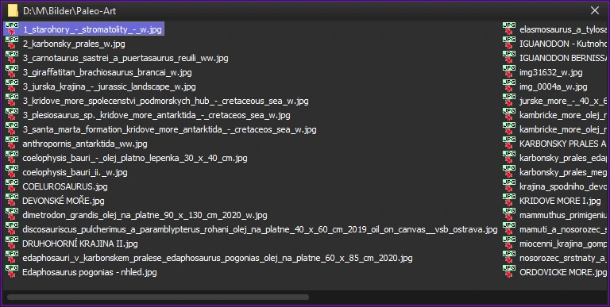

mkTools are a collection of GUI apps based on Qt6 that were created out of various frustrations with existing Linux GUI apps. At this point they include a file manager, an anything launcher and a file search tool. They are minimalist and screen space efficient in style and meant to be used with mouse and keyboard. Definitely no touch friendliness here. Think hotkeys, not buttons.
The apps are multi-platform and tested on Linux with KDE Plasma and Windows 10.



# mkFolderWidget

A minimalist file manager optimized to take up as little space as possible. It can be used with the included KWin script to tile its windows in a narrow column at the right side of the screen.


# mkLauncher

An apps and files launcher that doesn't use an indexing services.


# mkFileSearch

A file search tool that does not use indexing services. It allows for searching by filename and/or content either with normal search terms or RegEx expressions.

Without further arguments given, it opens in the user's $HOME folder.
The intended workflow for this app is to open it with `mkFileSearch /path/to/search`, either from a file manager that allows for launching external apps this way, or via hotkey.

Here's an sample script to put on a hotkey like Meta+F that takes the path inside the active windows's title bar (if one exists) and launches an mkFileSearch instance in that path:

```
#!/bin/bash

if [ "$XDG_SESSION_TYPE" == "wayland" ]; then
    TOOL="kdotool"
    OPTIONS=""
else
    TOOL="xdotool"
    OPTIONS="--onlyvisible"
fi

WINDOW_ID=$($TOOL getactivewindow)
FULL_TITLE=$($TOOL getwindowname "$WINDOW_ID")

# Erklärung:
# ^[^:]+:    -> Matcht vom Anfang (^) alles, was kein Doppelpunkt ist, bis zum ersten Doppelpunkt.
# (.*)       -> Gruppe 1: Der Pfad (alles bis zum nächsten Teil).
# \ —\ .*$   -> Der Trenner " — " und der App-Name bis zum Ende ($).
regex1="^[^:]+:(.*) — .*$"

# Erklärung:
# ^(.*)         -> Gruppe 1: Alles vom Anfang bis zum Leerzeichen
# \ @\          -> Der feste Trenner " @ "
# (.*)          -> Gruppe 2: Der Pfad
# \ —\ .*$      -> Der Trenner " — " und der Rest (AppName) bis zum Ende
#regex="^(.*) @ (.*) — .*$"+
# "(.*) @" is greedy and reads till the last "@". This version stops at the first:
regex2="^([^@]*) @ (.*) — .*$"

if [[ "$FULL_TITLE" =~ $regex1 ]]; then
    # BASH_REMATCH[1] ist der Pfad
    TITLE_PATH="${BASH_REMATCH[1]}"
elif [[ "$FULL_TITLE" =~ $regex2 ]]; then
    # BASH_REMATCH[1] ist der Dateiname
    # BASH_REMATCH[2] ist der Pfad
    # BASH_REMATCH[3] wäre der AppName (nicht genutzt)
    TITLE_PATH="${BASH_REMATCH[2]}/${BASH_REMATCH[1]}"
else
    #if [[ "$variable" == *" — Dolphin" ]]; then
        # Titel bereinigen
        # Wir löschen alles ab dem " — Dolphin" Teil (Achtung: langer Gedankenstrich!)
        # Die Syntax ${VAR%muster} löscht das Muster am Ende des Strings
        TITLE_PATH="${FULL_TITLE% — Dolphin}"
    #fi
fi

CLEAN_PATH="${TITLE_PATH/#~/$HOME}"


if [ -d "$CLEAN_PATH" ]; then   # CLEAN_PATH points to folder
    TARGET_PATH="$CLEAN_PATH"
elif [ -f "$CLEAN_PATH" ]; then # CLEAN_PATH points to file
    TARGET_PATH=$(dirname "$CLEAN_PATH")
else
    TARGET_PATH=$HOME
fi


$HOME/.local/bin/mkFileSearch "$TARGET_PATH" &

exit

fi
```

(mkFolderWidget displays its full path in the title bar by default. For other file managers like Dolphin, you might have to enable that option.)
